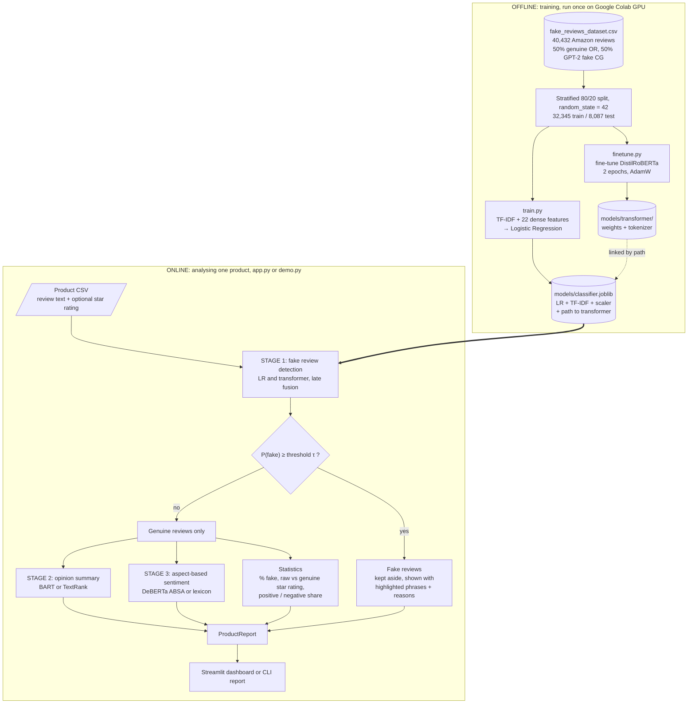
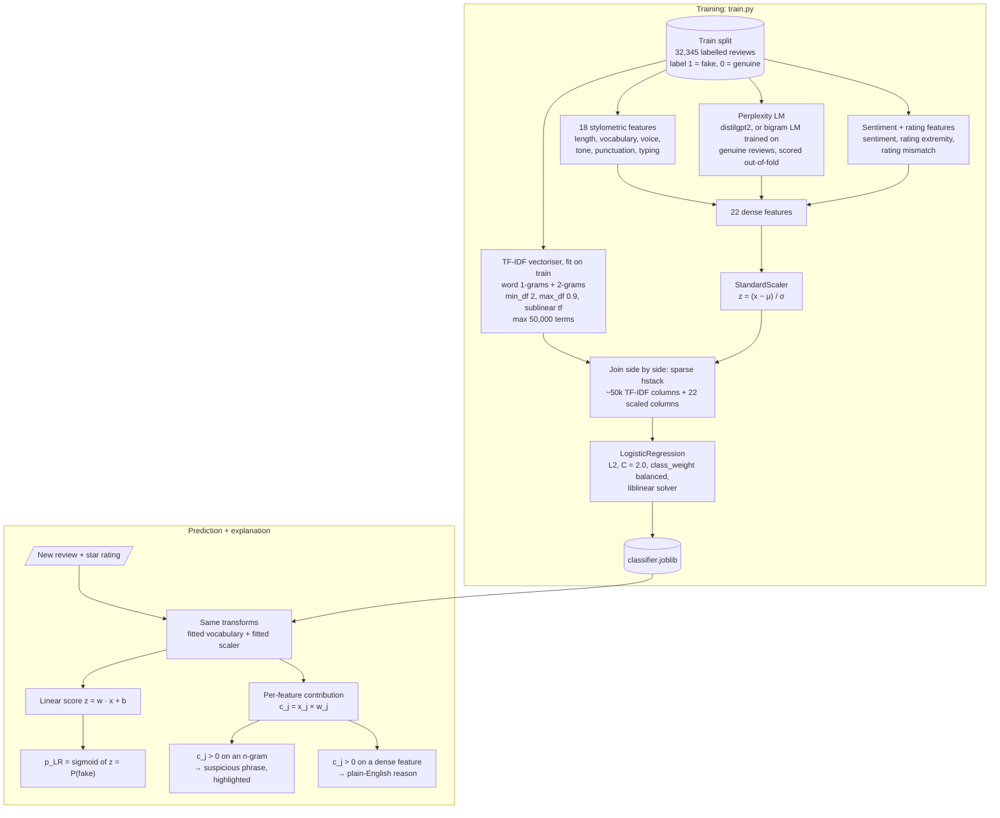
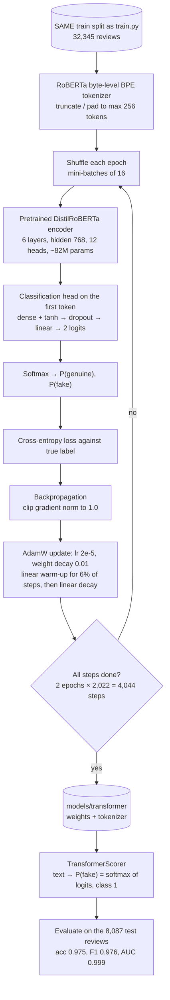
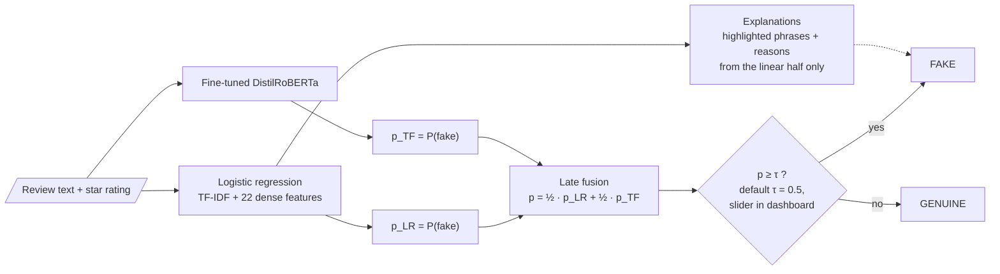
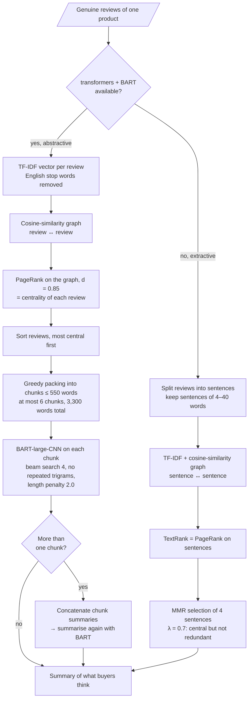
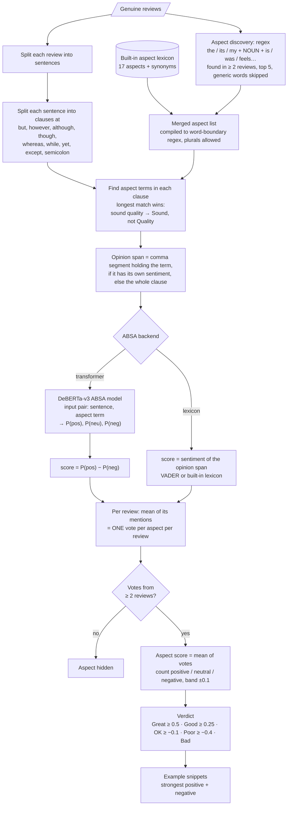
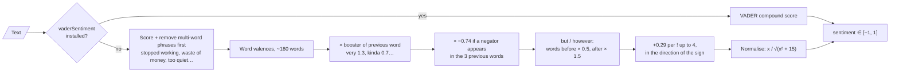
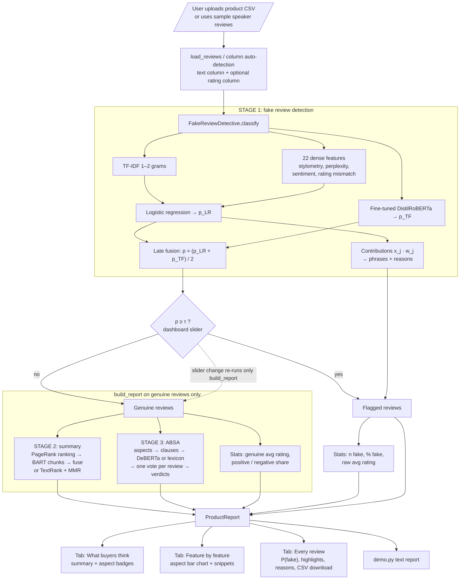
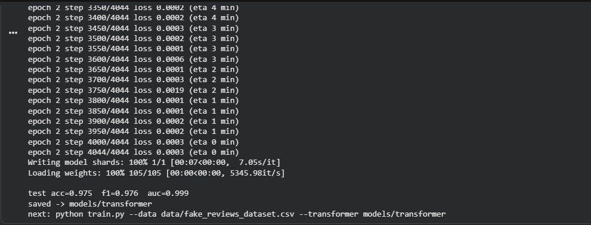
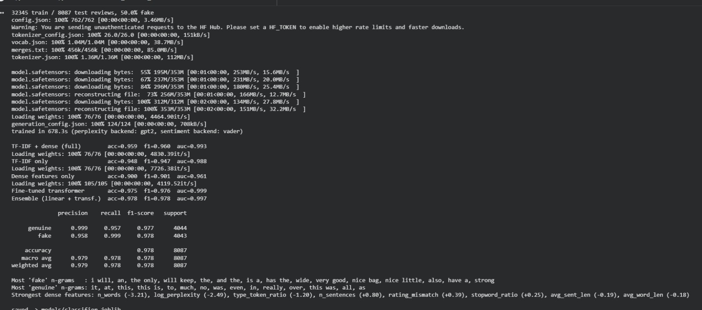

# FakeReview Detective

FakeReview Detective takes all the reviews for one product, flags the ones that look fake or
machine-generated, and then works only from the genuine ones. From those it writes a short
summary of what buyers think and gives each product feature a verdict
(for example *Sound: Great, Battery life: OK, Volume: Bad*).

It does three things, in order:

1. **Fake review detection**: two classifiers combined by **late fusion**:
   - an explainable **logistic regression** over TF-IDF n-grams plus 22 hand-made linguistic
     features (stylometry, perplexity, rating/sentiment mismatch), and
   - a fine-tuned **DistilRoBERTa** transformer.

   Their probabilities are averaged.
2. **Opinion summary**: summarises the genuine reviews, using BART if it is installed or
   TextRank otherwise.
3. **Aspect-based sentiment (ABSA)**: finds product features mentioned in the genuine reviews and
   rates each one from Great to Bad.

**Headline result** (8,087 held-out test reviews, Google Colab run): logistic regression
**95.9 %** accuracy, fine-tuned transformer **97.5 %**, late-fusion ensemble **97.8 %**
(F1 0.978, ROC-AUC 0.997). See [Evaluation results](#evaluation-results).

You can use it from a **Streamlit dashboard** (`app.py`) or the **command line** (`demo.py`).

> The flowcharts in this README are written in **Mermaid**. GitHub renders them automatically.
> In VS Code, install the *Markdown Preview Mermaid Support* extension to see them in the preview.

---

## Table of contents

- [Quick start](#quick-start)
- [Project layout](#project-layout)
- [Installation in detail](#installation-in-detail)
- [Using it](#using-it)
- [Training your own model](#training-your-own-model)
- [How it works](#how-it-works)
  - [1. Overall project flowchart](#1-overall-project-flowchart)
  - [2. Stage 1a: logistic regression classifier](#2-stage-1a-logistic-regression-classifier)
  - [3. Stage 1b: fine-tuned transformer classifier](#3-stage-1b-fine-tuned-transformer-classifier)
  - [4. Stage 1c: late fusion of both classifiers](#4-stage-1c-late-fusion-of-both-classifiers)
  - [5. Stage 2: opinion summarizer](#5-stage-2-opinion-summarizer)
  - [6. Stage 3: aspect-based sentiment analysis](#6-stage-3-aspect-based-sentiment-analysis)
  - [7. Shared sentiment scorer](#7-shared-sentiment-scorer)
  - [8. Final end-to-end flowchart](#8-final-end-to-end-flowchart)
  - [Pipeline and report](#pipeline-and-report)
  - [Why these models: summary](#why-these-models-summary)
  - [Key formulas at a glance](#key-formulas-at-a-glance)
- [Evaluation results](#evaluation-results)
- [Backends: with and without transformers](#backends-with-and-without-transformers)
- [Data](#data)
- [Input CSV format](#input-csv-format)
- [Common questions](#common-questions)
- [Limitations and caveats](#limitations-and-caveats)
- [Troubleshooting](#troubleshooting)

---

## Quick start

You need **Python 3.10 or newer** (developed on 3.13) and git.

```bash
git clone https://github.com/killerx1411/fakereviews.git
cd fakereviews
python -m venv .venv
```

Activate the virtual environment:

```bash
# Windows (PowerShell)
.\.venv\Scripts\Activate.ps1
# macOS / Linux
source .venv/bin/activate
```

Install the core packages and start the dashboard:

```bash
pip install numpy pandas scipy scikit-learn joblib streamlit altair vaderSentiment
streamlit run app.py
```

A browser tab opens at http://localhost:8501 showing the sample product
(`data/sample_product_reviews.csv`, a portable Bluetooth speaker). Upload your own CSV from the
sidebar to analyse another product.

The repository already includes a trained classifier (`models/classifier.joblib`, trained on
the full 40k-review dataset), so you do **not** need to train anything first.

For the command-line report instead:

```bash
python demo.py
```

> **Want the full transformer models?** Run `pip install -r requirements.txt` instead (see
> [Installation in detail](#installation-in-detail)). The first run then downloads roughly
> 2.5 GB of pretrained models from Hugging Face, and analysis on CPU becomes much slower.

---

## Project layout

```
fakereviews/
├── app.py                         Streamlit dashboard
├── demo.py                        Command-line report for one product
├── train.py                       Train + evaluate the fake review classifier
├── finetune.py                    Fine-tune a transformer classifier (GPU recommended)
├── requirements.txt               Dependencies (core + optional)
├── FINETUNING.md                  Step-by-step guide for fine-tuning on Google Colab
├── docs/                          Colab screenshots used in this README
├── data/
│   ├── fake_reviews_dataset.csv   Training data: 40k Amazon reviews, labelled OR / CG
│   └── sample_product_reviews.csv Example product (Bluetooth speaker) for the demo
├── models/
│   └── classifier.joblib          Trained classifier (linear model, bigram perplexity)
└── fakereview/                    The library
    ├── __init__.py                Public API
    ├── data.py                    CSV loading, column detection, train/test split, synthetic data
    ├── text_utils.py              Sentence / clause / word splitting, HTML highlighting
    ├── sentiment.py               Sentiment scoring (VADER or built-in lexicon)
    ├── features.py                Stylometric features, perplexity, rating mismatch
    ├── classifier.py              Stage 1: FakeReviewClassifier + explanations + late fusion
    ├── transformer.py             Wrapper for the fine-tuned transformer (P(fake))
    ├── summarizer.py              Stage 2: OpinionSummarizer
    ├── absa.py                    Stage 3: AspectSentimentAnalyzer
    └── pipeline.py                FakeReviewDetective: ties the stages into one report
```

Not in the repository (see `.gitignore`): the virtual environment, Python caches, and
fine-tuned transformer weights. The weights are over 300 MB, above GitHub's file size limit.
Generate them with `finetune.py` (see [FINETUNING.md](FINETUNING.md)).

---

## Installation in detail

### Option A: core only (fast, small, recommended to start)

```bash
pip install numpy pandas scipy scikit-learn joblib streamlit altair vaderSentiment
```

Everything works with these packages. Each stage uses its lightweight backend: bigram
perplexity, extractive TextRank summary, and lexicon aspect sentiment.
`vaderSentiment` is optional but gives better sentiment scores than the built-in lexicon.

### Option B: everything, including transformers

PyTorch is best installed first, from the official index for your platform. CPU-only on Windows/Linux:

```bash
pip install torch --index-url https://download.pytorch.org/whl/cpu
pip install -r requirements.txt
```

(For an NVIDIA GPU, pick the CUDA command from https://pytorch.org/get-started/locally/.)

With `transformers` and `torch` installed, each stage switches to its transformer backend
automatically. The first run downloads the pretrained models:

| Model | Used for | Approx. size |
|---|---|---|
| `distilbert/distilgpt2` | perplexity feature (only when **training** with `--perplexity auto/gpt2`) | 350 MB |
| `facebook/bart-large-cnn` | abstractive opinion summary | 1.6 GB |
| `yangheng/deberta-v3-base-absa-v1.1` | aspect sentiment | 700 MB |

To keep the light backends with transformers installed, pick **Summary: extractive** and
**Aspect sentiment: lexicon** in the dashboard's *Models* section, or pass
`--summarizer extractive --absa lexicon` to `demo.py`.

### A note on the saved model and library versions

`models/classifier.joblib` is a pickled scikit-learn object. It was saved with
**scikit-learn 1.9.1, numpy 2.5, pandas 3.0, Python 3.13**. A very different scikit-learn
version may print an `InconsistentVersionWarning` or fail to load it. If that happens, either
install a matching version (`pip install scikit-learn==1.9.1`) or retrain. On CPU the
bigram model trains in a few minutes:

```bash
python train.py --data data/fake_reviews_dataset.csv --perplexity bigram
```

---

## Using it

### Dashboard (`app.py`)

```bash
streamlit run app.py
```

**Sidebar**
- **Upload a CSV** with one product's reviews. Without one, the sample speaker reviews are shown.
- **Review text column / Star rating column**: guessed automatically, change them if the guess is wrong.
  The rating column is optional, but some features (rating extremity, rating/sentiment
  mismatch) and the before/after star rating need it.
- **Flag as fake when probability is at least**: the decision threshold (default 0.5). A higher
  value flags fewer reviews and lets more of them into the summary. A lower value is stricter.
- **Models** (expander): which classifier file to load, and which summary and aspect backends to use.

**Top metrics**: number of reviews, how many were flagged, the listed average star rating and
the average from genuine reviews only (with the difference).

**Tabs**
- **What buyers think**: the summary of genuine reviews, the share of positive and negative
  genuine reviews, and a colour-coded verdict badge for each aspect.
- **Feature by feature**: bar chart of each aspect's average sentiment (−1 to +1), plus
  expandable example snippets (🟢 positive, 🔴 negative, ⚪ neutral). Aspects marked
  *(found in reviews)* were discovered in this product's reviews rather than taken from the
  built-in list.
- **Every review**: every review with its fake probability and stars. Flagged reviews show
  the **suspicious phrases highlighted** and the **reasons** (e.g. *"Very predictable,
  template-like wording"*). You can filter, sort by suspicion, and **download all results as CSV**.

### Command line (`demo.py`)

```bash
python demo.py                                              # sample product
python demo.py --reviews path/to/reviews.csv                # your own product
python demo.py --threshold 0.7 --out results.csv            # flag fewer reviews, save per-review CSV
python demo.py --summarizer extractive --absa lexicon       # force light backends
```

| Flag | Default | Meaning |
|---|---|---|
| `--reviews` | `data/sample_product_reviews.csv` | CSV of one product's reviews |
| `--model` | `models/classifier.joblib` | trained classifier |
| `--threshold` | `0.5` | fake-probability cut-off |
| `--summarizer` | `auto` | `auto` / `abstractive` / `extractive` |
| `--absa` | `auto` | `auto` / `transformer` / `lexicon` |
| `--out` | none | write per-review verdicts to this CSV |

Real output on the sample product (`python demo.py --summarizer extractive --absa lexicon`, shortened):

```
Reviews analysed : 22
Flagged as fake  : 5 (23%)
Star rating      : 3.86 raw -> 3.82 genuine only

Public opinion (extractive, 17 genuine reviews):
  great quality, ok battery, the volume though is really disappointing at max. sound quality is good
  but volume is weak outdoors. Great product, great price, great quality! Excellent build quality, ...

Aspects:
  Volume                 Poor   (score -0.38, 9 reviews)
  Quality                Great  (score +0.56, 8 reviews)
  Battery life           OK     (score +0.03, 8 reviews)
  Sound                  Good   (score +0.28, 7 reviews)
  Price / value          Good   (score +0.37, 3 reviews)
  Connectivity           Poor   (score -0.24, 2 reviews)

Flagged reviews:
  [0.90] I highly recommend this product. It is the perfect gift and the quality is excellent. You ...
         phrases: quality is, the quality, recommend this, excellent, the perfect, love
         reasons: Very predictable, template-like wording (low perplexity); Very short review; Many function words
  ...
```

(Numbers change with the model and backends you use.)

### As a Python library

```python
from fakereview import FakeReviewDetective

det = FakeReviewDetective.from_model_file("models/classifier.joblib",
                                          summarizer_backend="extractive", absa_backend="lexicon")
report = det.analyze(["Great sound but the volume is too low.", "Best product ever!!! Highly recommend!"],
                     ratings=[4, 5])
print(report.to_text())
report.reviews_frame()   # pandas DataFrame, one row per review
report.aspects_frame()   # pandas DataFrame, one row per aspect
```

---

## Training your own model

### Train and evaluate the classifier (`train.py`)

```bash
# full training: prints accuracy / F1 / ROC-AUC, top n-grams, strongest features, saves the model
python train.py --data data/fake_reviews_dataset.csv

# add an ablation table (TF-IDF only vs dense features only vs both)
python train.py --data data/fake_reviews_dataset.csv --ablation

# quick run on 5,000 reviews with the cheap bigram perplexity (no GPT-2)
python train.py --data data/fake_reviews_dataset.csv --sample 5000 --perplexity bigram

# smoke test with no dataset (synthetic data, scores mean nothing)
python train.py --demo
```

| Flag | Default | Meaning |
|---|---|---|
| `--data` | none | labelled CSV |
| `--demo` | off | use synthetic data instead (code-path check only) |
| `--out` | `models/classifier.joblib` | where to save the model |
| `--perplexity` | `auto` | `gpt2` (needs transformers), `bigram`, or `auto` (GPT-2 if available) |
| `--sample` | `0` (all) | subsample N rows for a quick run |
| `--ablation` | off | also train/evaluate text-only and dense-only models |
| `--transformer` | none | path to a fine-tuned model from `finetune.py`; averaged with the linear model |

The split is always stratified 80/20 with `random_state=42` (`fakereview.data.train_test`), so
results can be reproduced and compared across runs.

### Fine-tune the transformer (`finetune.py`)

```bash
python finetune.py --data data/fake_reviews_dataset.csv            # writes models/transformer
python train.py --data data/fake_reviews_dataset.csv --ablation --transformer models/transformer
```

This fine-tunes `distilbert/distilroberta-base` (AdamW, lr 2e-5, 2 epochs, max 256 tokens) on
the **same** train split as `train.py`, then fuses it with the linear model. On CPU this takes
hours. Use a GPU, e.g. free Google Colab. **[FINETUNING.md](FINETUNING.md) has the complete
step-by-step guide.** If you use `--sample`, pass the same value to both scripts so their
train/test splits match.

`classifier.joblib` stores only the *path* to the transformer folder, not the weights, so
keep `models/transformer/` next to it and run from the project root.

---

## How it works

This section has one flowchart per component, then the formulas behind it and the reason we
chose that model. Section 8 joins everything into one final flowchart.

### 1. Overall project flowchart

The project has two phases. **Offline**, we train two fake-review classifiers on a labelled
dataset (we did this on Google Colab). **Online**, we load those models and analyse the reviews
of one product.



**Why this design?** If fake reviews were summarised along with real ones, they would distort
both the summary and the star rating. So we **filter first, then summarise**. Stages 2 and 3
only ever see reviews that Stage 1 thinks are genuine.

---

### 2. Stage 1a: logistic regression classifier

Files: `fakereview/classifier.py`, `fakereview/features.py`, `train.py`.



#### 2.1 Input A: TF-IDF word n-grams

TF-IDF turns each review into a sparse vector with one column per word or two-word phrase.
A phrase gets a high weight when it is frequent in this review but rare across all reviews.
We use 1-grams and 2-grams, so phrases such as *"highly recommend"* and *"will keep"* are
captured, not only single words.

$$
\text{tf}(t,d) = 1 + \ln\big(\text{count}(t,d)\big) \qquad \text{(sublinear tf)}
$$

$$
\text{idf}(t) = \ln\frac{1 + n}{1 + \text{df}(t)} + 1 \qquad \text{(smoothed, scikit-learn default)}
$$

$$
\text{tfidf}(t,d) = \text{tf}(t,d)\cdot\text{idf}(t), \quad \text{then each review vector is L2-normalised}
$$

where *n* is the number of training reviews and df(*t*) is the number of reviews that contain *t*.
- **Sublinear tf**: a word repeated 10 times is not 10× as important.
- `min_df=2` drops one-off typos.
- `max_df=0.9` drops terms that appear in more than 90 % of reviews.

#### 2.2 Input B: 22 dense (hand-crafted) features

| Group | Features | Why it helps |
|---|---|---|
| Length / structure | `n_words` (log1p), `n_sentences`, `avg_word_len`, `avg_sent_len`, `sent_len_std` | generated reviews are shorter and more uniform |
| Vocabulary | `type_token_ratio` = unique words / words, `stopword_ratio` | generated text repeats words |
| Voice | `first_person_ratio` (I, my…), `second_person_ratio` (you, your…) | real buyers tell their own experience; ads address "you" |
| Tone | `superlative_ratio` (best, perfect, amazing…), `hedge_ratio` (maybe, kinda, though…) | hype vs. realistic caveats |
| Punctuation / typing | `exclamations`, `questions`, `punct_ratio`, `upper_ratio`, `digit_ratio`, `lowercase_sentence_starts`, `repeated_chars` ("sooo") | humans type casually and mention concrete numbers |
| Language model | `log_perplexity` | machine text is unusually predictable |
| Sentiment & rating | `sentiment` ∈ [−1, 1], `rating_extremity`, `rating_mismatch` | 5 stars on a negative text is suspicious |

Each ratio is a count divided by the number of words *N*, for example
`first_person_ratio = #{I, me, my, …} / N`.

**Rating features** (rating *r* ∈ 1…5, sentiment *s* ∈ [−1, 1]):

$$
\text{rating\_extremity} = \frac{|r - 3|}{2} \in [0,1]
\qquad
\text{rating\_mismatch} = \frac{1}{2}\left|\frac{r-3}{2} - s\right| \in [0,1]
$$

The term (r − 3)/2 maps the star rating onto the same −1…+1 scale as sentiment. The mismatch
is then 0 when the text and the stars agree, and 1 when they are opposite. Both features are 0
when there is no rating.

**Perplexity** measures how "surprised" a language model is by the text. GPT-2-generated
reviews were produced by sampling high-probability tokens, so they have **low perplexity**.

$$
\log \text{PPL}(x) = -\frac{1}{T}\sum_{t=1}^{T} \log p(x_t \mid x_{<t})
$$

There are two backends:
- **`gpt2`**: *p* comes from `distilgpt2`, a 6-layer distilled GPT-2. Padding tokens are masked out.
- **`bigram`** (no dependencies): an interpolated bigram model trained **only on genuine
  training reviews**, with λ = 0.7:

$$
P(w_t \mid w_{t-1}) = \lambda\,\frac{c(w_{t-1}, w_t)}{c(w_{t-1})} + (1-\lambda)\,\frac{c(w_t) + 1}{N + V}
$$

  Here *c* is a count, *N* is the total number of tokens and *V* is the vocabulary size + 1
  (add-one smoothed unigram back-off).

  **Out-of-fold scoring.** Training reviews are scored with 5-fold cross-fitting: a review is
  scored by a bigram LM trained on the *other* 4 folds. If an LM scored reviews it had been
  trained on, genuine training reviews would look unrealistically predictable, and the
  classifier would learn that artefact instead of a real signal.

**Standardisation.** The dense features are on very different scales (a ratio vs. a sentence
count). We scale each one to mean 0 and variance 1, so no feature dominates just because of
its units and the coefficients can be compared:

$$
z_j = \frac{x_j - \mu_j}{\sigma_j}
$$

#### 2.3 The model: logistic regression

The final feature vector **x** is the TF-IDF vector and the 22 standardised dense features
placed side by side. Logistic regression learns one weight per column:

$$
P(\text{fake} \mid \mathbf{x}) = \sigma(\mathbf{w}^\top\mathbf{x} + b) = \frac{1}{1 + e^{-(\mathbf{w}^\top\mathbf{x} + b)}}
$$

Training minimises the L2-regularised, class-weighted log-loss, with *y* ∈ {−1, +1}:

$$
\min_{\mathbf{w},b}\; \frac{1}{2}\lVert\mathbf{w}\rVert^2 + C\sum_{i=1}^{n} s_{y_i}\,\log\!\left(1 + e^{-y_i(\mathbf{w}^\top\mathbf{x}_i + b)}\right)
$$

- **C = 2.0** is the inverse of regularisation strength. A larger C fits the data more
  closely, a smaller C keeps the weights smaller.
- `class_weight="balanced"` sets s_c = n / (2·n_c). With our 50/50 data this is ≈ 1, but it
  keeps the model fair if a dataset is imbalanced.
- `liblinear` is a fast solver for sparse, high-dimensional binary problems.

**Explanation of one prediction.** Because the model is linear, the score splits exactly into
one contribution per feature:

$$
z = b + \sum_j c_j, \qquad c_j = x_j\,w_j
$$

- A positive *c_j* on an **n-gram** column → that phrase is **highlighted** as suspicious.
  N-grams made only of stop words are skipped, and overlapping phrases are merged, so you see
  *"highly recommend"* rather than *"highly"* and *"recommend"* separately.
- A positive *c_j* on a **dense** column → a **plain-English reason** from the `REASONS` table.
  The reason text depends on whether the standardised value is above or below average, e.g.
  *"Very predictable, template-like wording (low perplexity)"*.

#### 2.4 Why logistic regression?

| Reason | Detail |
|---|---|
| **Explainable** | Every prediction splits exactly into per-feature contributions, so we can show *which* words and *which* signals made a review look fake. A transformer cannot do this exactly. |
| **Calibrated probabilities** | It outputs a real probability. We need that to average it with the transformer and to let the user move the threshold slider. SVMs give margins, not probabilities, and Naive Bayes probabilities are badly calibrated. |
| **Suits sparse text** | ~50k sparse TF-IDF columns + 22 dense columns; trains in seconds on CPU. Tree models are slow on this and much harder to explain. |
| **Strong baseline** | 95.9 % accuracy on its own (see results). |
| **Runs anywhere** | No GPU needed at inference. |

---

### 3. Stage 1b: fine-tuned transformer classifier

Files: `finetune.py` (training), `fakereview/transformer.py` (`TransformerScorer` for prediction).



#### 3.1 How it works

1. **Tokenise.** The review is split into byte-level BPE sub-word tokens (max 256).
   Byte-level BPE never produces "unknown" tokens, so typos, emojis and slang are still
   represented.
2. **Encode.** Six Transformer layers of **multi-head self-attention** produce one contextual
   vector per token. Each token's vector depends on every other token:

$$
\text{Attention}(Q,K,V) = \text{softmax}\!\left(\frac{QK^\top}{\sqrt{d_k}}\right)V
$$

3. **Classify.** The vector of the first token (`<s>`, RoBERTa's equivalent of `[CLS]`) goes
   through a small head that outputs two logits. Softmax turns them into probabilities:

$$
P(\text{fake}) = \frac{e^{z_{\text{fake}}}}{e^{z_{\text{genuine}}} + e^{z_{\text{fake}}}}
$$

4. **Fine-tune.** All weights (pretrained encoder + new head) are updated to minimise
   cross-entropy:

$$
\mathcal{L} = -\frac{1}{B}\sum_{i=1}^{B}\Big[y_i \log p_i + (1-y_i)\log(1-p_i)\Big]
$$

#### 3.2 Training hyper-parameters

| Setting | Value | Why |
|---|---|---|
| Base model | `distilbert/distilroberta-base` | see below |
| Epochs | 2 | enough to converge (loss ≈ 0.0002 at the end) without over-fitting |
| Batch size | 16 | fits a free Colab T4 GPU at 256 tokens |
| Learning rate | 2 × 10⁻⁵ | standard for fine-tuning BERT-family models; larger values destroy pretrained knowledge |
| Optimiser | AdamW, weight decay 0.01 | Adam with decoupled L2 regularisation |
| Schedule | linear warm-up over the first 6 % of steps (~243), then linear decay to 0 | warm-up avoids large, destabilising updates while the new head is still random |
| Gradient clipping | max norm 1.0 | prevents exploding gradients |
| Max length | 256 tokens | covers almost every review; longer ones are truncated |
| Seed | 42 | reproducible |

Learning rate at step *t* (with *T* total steps and *W* = 0.06·*T* warm-up steps):

$$
\eta_t = \begin{cases} \eta_{\max}\,\dfrac{t}{W} & t < W \\[2mm] \eta_{\max}\,\dfrac{T - t}{T - W} & t \ge W \end{cases}
$$

#### 3.3 Why DistilRoBERTa?

- **Context.** Unlike TF-IDF, which only sees which words occur, a transformer reads word
  order and context. It picks up the subtle fluency patterns of GPT-2 text that n-grams miss.
  This is where the +1.6 points of accuracy over logistic regression come from.
- **RoBERTa over BERT.** RoBERTa was pretrained longer, on more data, with dynamic masking and
  without BERT's next-sentence objective. It usually beats BERT on classification. Its
  byte-level tokenizer also suits messy review text.
- **Distilled.** DistilRoBERTa has 6 layers instead of 12 (~82M vs 125M parameters). It is
  about **2× faster** and keeps most of RoBERTa's accuracy, so a full 2-epoch run fits in a
  free Colab session.
- **Same split as the linear model.** `finetune.py` uses the same `train_test()` function
  (`random_state=42`). Neither model ever sees the test reviews, so the ensemble evaluation is
  fair.

---

### 4. Stage 1c: late fusion of both classifiers

File: `fakereview/classifier.py` (`predict_proba`), enabled by `train.py --transformer models/transformer`.



**Formula**

$$
p_{\text{final}} = \frac{p_{\text{LR}} + p_{\text{TF}}}{2}, \qquad \hat{y} = \mathbb{1}\left[p_{\text{final}} \ge \tau\right]
$$

**Why late fusion (averaging the output probabilities)?**

- **The models make different mistakes.** One is a bag-of-n-grams model with hand-crafted
  style signals; the other is a contextual neural model. Averaging two models that are good in
  different ways cancels some of each one's errors. In our run the ensemble is the most
  accurate model (97.8 %).
- **Keeps explainability.** The linear half still produces the highlighted phrases and reasons
  for every review. We get the transformer's accuracy and the linear model's transparency.
- **Modular.** The models are trained separately, so either can be retrained or swapped
  without touching the other. `transformer_scorer` is just any function texts → P(fake).
  Without a transformer, the pipeline still works with the linear model alone.
- **Why not early fusion?** Early fusion would concatenate the transformer's embeddings with
  the TF-IDF features into one model. That needs joint training and breaks the exact per-feature
  explanation.
- **Why not learned weights (stacking)?** Learning the fusion weights needs a third, held-out
  validation set that neither model trained on. A plain average needs no extra data and cannot
  over-fit. Both inputs are already probabilities on the same 0–1 scale.

---

### 5. Stage 2: opinion summarizer

File: `fakereview/summarizer.py`. Only **genuine** reviews are summarised.



#### 5.1 Centrality: TextRank / PageRank

We want the reviews or sentences that best represent the **majority opinion**. We build a
graph where each node is a review (or sentence), and the edge weights are TF-IDF **cosine
similarity**:

$$
\text{sim}(a,b) = \frac{\mathbf{a}\cdot\mathbf{b}}{\lVert\mathbf{a}\rVert\,\lVert\mathbf{b}\rVert}
$$

We then run PageRank by power iteration, with damping *d* = 0.85, row-normalised transition
matrix *P*, and *N* nodes:

$$
\mathbf{r} \leftarrow \frac{1-d}{N}\mathbf{1} + d\,P^\top\mathbf{r} \qquad \text{(until } \lVert\Delta\mathbf{r}\rVert_1 < 10^{-8}\text{, max 100 iterations)}
$$

A review that is similar to many other reviews gets a high score. It is "what most people are
saying".

#### 5.2 Abstractive path: BART

- **Model**: `facebook/bart-large-cnn`, used as-is without fine-tuning. BART is a seq2seq
  Transformer (12-layer bidirectional encoder + 12-layer autoregressive decoder, ~406M
  parameters). It was pretrained as a denoising autoencoder and then fine-tuned for
  summarisation on the CNN/DailyMail news dataset. It **writes new sentences** instead of
  copying them.
- **Chunking.** BART reads at most 1,024 tokens. So the most central reviews are packed into
  ~550-word chunks, each chunk is summarised, and the chunk summaries are summarised once more
  (a two-level "map-reduce" summary). Ranking by centrality first means the limited budget
  goes to representative reviews, not outliers.
- **Generation settings.**
  - 4-beam search keeps the 4 best partial summaries at each step.
  - `no_repeat_ngram_size=3` stops repeated phrases.
  - `length_penalty=2.0` favours fuller summaries.
  - Output length adapts to the input:
    max = min(160, max(40, 0.6·n)) tokens and min = min(max − 10, max(15, 0.15·n)),
    where *n* is the input word count.

#### 5.3 Extractive path: TextRank + MMR

This is the fallback when there are no transformers. It needs no training and no GPU.
Sentences are ranked by TextRank, then 4 are chosen with **Maximal Marginal Relevance**. MMR
avoids picking the same opinion 4 times:

$$
\text{MMR} = \arg\max_{i \notin S}\Big[\lambda\cdot\text{score}_i - (1-\lambda)\max_{j\in S}\text{sim}(i,j)\Big], \qquad \lambda = 0.7
$$

where *S* is the set of sentences already chosen.

#### 5.4 Why these models?

- **BART-large-CNN** is one of the strongest freely available off-the-shelf summarisers. We
  have no labelled review summaries, so we could not train our own.
- **TextRank** is unsupervised, fast and dependency-free. It always works, e.g. on a laptop
  without PyTorch.
- **Summarising genuine reviews only** is the point of the project. The summary describes what
  real buyers say, not marketing text.

---

### 6. Stage 3: aspect-based sentiment analysis

File: `fakereview/absa.py`.

Overall sentiment says "this review is positive". **ABSA** asks a finer question: *positive
about what?* In *"great sound but the volume is too low"*, Sound is positive and Volume is
negative.



#### 6.1 Steps

1. **Aspect extraction (what is talked about)**
   - A built-in, editable lexicon (`DEFAULT_ASPECTS`) of 17 common aspects with synonyms:
     Quality, Price / value, Battery life, Sound, Volume, Display, Performance, Camera,
     Design, Size / weight, Comfort / fit, Durability, Ease of use, Connectivity,
     Delivery / packaging, Customer service, Taste / smell.
   - **Discovery** of product-specific aspects with the pattern
     *"(the | its | their | this | my) + noun + (is | was | feels | sounds | …)"*.
     *"the **hinge** is loose"* → aspect *Hinge*. A discovered aspect must appear in at
     least 2 reviews, at most 5 are added, and generic words (product, item, thing…) are ignored.
2. **Clause splitting.** Splitting sentences at contrast words means each opinion word is
   credited to the right aspect. Without it, *"great sound but weak volume"* would give both
   aspects the same mixed score.
3. **Longest match wins.** *"sound quality"* belongs to Sound, not Quality.
4. **Opinion span.** In a clause like *"great quality, ok battery, weak volume"*, each aspect
   gets its own comma segment.
5. **Scoring.**
   - Transformer backend: `yangheng/deberta-v3-base-absa-v1.1` classifies the pair
     *(sentence, aspect)*:

$$
\text{score} = P(\text{positive}) - P(\text{negative}) \in [-1, 1]
$$

   - Lexicon backend: the [shared sentiment scorer](#7-shared-sentiment-scorer) applied to the
     opinion span.
6. **Aggregation: one review, one vote.** First average a review's mentions of an aspect.
   Then average over reviews:

$$
\text{score}(a) = \frac{1}{|R_a|}\sum_{r \in R_a} \frac{1}{|M_{r,a}|}\sum_{m \in M_{r,a}} \text{score}(m)
$$

   Here *R_a* is the set of reviews that mention aspect *a*, and *M_{r,a}* is the set of
   mentions of *a* in review *r*. Without this step, one long, rambling review could dominate
   an aspect.
7. **Verdict:** Great ≥ 0.5 > Good ≥ 0.25 > OK ≥ −0.1 > Poor ≥ −0.4 > Bad.

#### 6.2 Why these models?

- **DeBERTa-v3 ABSA** (`yangheng/deberta-v3-base-absa-v1.1`) is a DeBERTa-v3-base model that
  its author fine-tuned for aspect-level sentiment on public ABSA datasets (e.g. SemEval
  laptop/restaurant reviews). It takes the aspect as a second input, so it judges sentiment
  **towards that aspect**, not the whole sentence. It also handles negation, sarcasm and
  implicit opinions much better than word lists. DeBERTa's *disentangled attention* encodes
  content and position separately, and it leads benchmarks among base-size encoders. We use it
  off the shelf because we have no aspect-labelled data of our own.
- **The lexicon fallback** is transparent and needs no GPU. With clause splitting it is
  accurate enough for clear statements like *"the battery died after 2 weeks"*.

---

### 7. Shared sentiment scorer

File: `fakereview/sentiment.py`. Returns a score in [−1, 1]. It is used by:
- the classifier's `sentiment` and `rating_mismatch` features,
- the positive/negative share of genuine reviews,
- lexicon ABSA.



Both VADER and the built-in lexicon squash the raw sum *x* with the same normalisation:

$$
s = \frac{x}{\sqrt{x^2 + \alpha}}, \qquad \alpha = 15
$$

**Why VADER?** It is a rule-based sentiment model designed for short, informal text. It
handles negation, intensifiers, "but" and exclamation marks, needs no training, and is fast
enough to run on 40k reviews as a feature. The built-in lexicon copies the same ideas, with
review-specific phrases added, so the project runs with zero extra dependencies.

---

### 8. Final end-to-end flowchart

This is everything above joined into the path that one product's reviews take, from CSV upload
to dashboard.



---

### Pipeline and report

File: `fakereview/pipeline.py`.

- `FakeReviewDetective.classify()` runs the classifier and its explanations once.
- `FakeReviewDetective.build_report()` applies the threshold and runs summary and ABSA on the
  genuine reviews. It is separate from `classify()` so the dashboard can change the threshold
  without classifying again (Streamlit also caches both steps).
- `ProductReport` holds:
  - `reviews`: per-review `ReviewResult`s,
  - `summary`,
  - `aspects`,
  - `stats`: counts, % fake, average rating before and after filtering, positive/negative share.

  It has helpers `to_text()`, `reviews_frame()` and `aspects_frame()`.

### Other modules

- `fakereview/data.py`: CSV loading with automatic column detection, the shared train/test
  split, and a tiny **synthetic** dataset used only for `train.py --demo`.
- `fakereview/text_utils.py`: regex-based sentence, clause, segment and word splitting, plus
  `highlight()`, which HTML-escapes a review and wraps the suspicious phrases in `<mark>`.
- `fakereview/transformer.py`: `TransformerScorer(path)`, a callable `texts → P(fake)`. Only
  the path is pickled, so the classifier file stays small.

### Why these models: summary

| Component | Model / method | Type | Why this one |
|---|---|---|---|
| Text features | TF-IDF word 1–2-grams | statistical | captures tell-tale phrases; down-weights common words; sparse and fast |
| Style features | 18 stylometric ratios | hand-crafted | model-independent writing-style signals; each one is human-readable |
| Predictability | distilgpt2 / bigram LM perplexity | language model | machine text is unusually predictable |
| Classifier A | Logistic regression | linear, supervised | exact explanations, calibrated probabilities, CPU-fast |
| Classifier B | DistilRoBERTa, fine-tuned | Transformer encoder, supervised | understands context and fluency; most accurate single model; 2× faster than RoBERTa |
| Fusion | Average of probabilities | late fusion | complementary errors, keeps explanations, modular, no extra data needed |
| Summary | BART-large-CNN | seq2seq Transformer, pretrained | strong off-the-shelf abstractive summariser |
| Summary fallback | TextRank + MMR | unsupervised graph | no training, no GPU, avoids redundancy |
| Aspect sentiment | DeBERTa-v3 ABSA | Transformer, pretrained | sentiment *towards a given aspect* |
| Aspect fallback | Clause-level lexicon | rule-based | transparent and dependency-free |
| Sentiment | VADER / built-in lexicon | rule-based | no training; handles negation and intensifiers |

### Key formulas at a glance

| Concept | Formula |
|---|---|
| Sublinear TF | tf = 1 + ln(count) |
| Smoothed IDF | idf = ln((1 + n) / (1 + df)) + 1 |
| Standardisation | z = (x − μ) / σ |
| Logistic regression | P(fake) = σ(w·x + b) = 1 / (1 + e^−(w·x+b)) |
| LR objective | ½‖w‖² + C Σ sᵢ log(1 + e^(−yᵢ(w·xᵢ+b))) |
| Explanation | contribution c_j = x_j · w_j |
| Log-perplexity | −(1/T) Σ log p(x_t \| x_<t) |
| Bigram interpolation | λ·c(w₋₁,w)/c(w₋₁) + (1−λ)·(c(w)+1)/(N+V), λ = 0.7 |
| Rating mismatch | ½ · \|(r − 3)/2 − s\| |
| Self-attention | softmax(QKᵀ / √d_k) V |
| Softmax | P(fake) = e^z_fake / (e^z_genuine + e^z_fake) |
| Cross-entropy | −[y log p + (1 − y) log(1 − p)] |
| Late fusion | p = (p_LR + p_TF) / 2, fake if p ≥ τ |
| Cosine similarity | a·b / (‖a‖ ‖b‖) |
| PageRank | r = (1 − d)/N + d Pᵀ r, d = 0.85 |
| MMR | argmax [λ·score_i − (1 − λ)·max_j sim(i, j)], λ = 0.7 |
| ABSA score | P(positive) − P(negative) |
| Sentiment normalisation | x / √(x² + 15) |

---

## Evaluation results

### Setup

| Item | Value |
|---|---|
| Dataset | Salminen et al. (2022) Fake Reviews Dataset, 40,432 reviews |
| Split | stratified 80/20, `random_state=42` → **32,345 train / 8,087 test**, 50.0 % fake |
| Test classes | 4,044 genuine, 4,043 fake |
| Hardware | Google Colab GPU |
| Linear model | `train.py --ablation --transformer models/transformer`; perplexity backend **gpt2** (distilgpt2), sentiment backend **vader**; trained in 678 s (most of it GPT-2 scoring) |
| Transformer | `finetune.py`: DistilRoBERTa, 2 epochs × 2,022 steps = 4,044 steps, batch 16 |

Both models were evaluated on the **same 8,087 test reviews**. Neither model saw them during
training.

### Metrics used

With TP = fakes caught, FP = genuine reviews wrongly flagged, FN = fakes missed, and
TN = genuine reviews correctly passed:

$$
\text{Accuracy} = \frac{TP + TN}{TP + TN + FP + FN} \quad
\text{Precision} = \frac{TP}{TP + FP} \quad
\text{Recall} = \frac{TP}{TP + FN} \quad
F_1 = \frac{2\cdot\text{Precision}\cdot\text{Recall}}{\text{Precision} + \text{Recall}}
$$

**ROC-AUC** is the area under the ROC curve (true-positive rate vs. false-positive rate as the
threshold moves). It equals the probability that a randomly chosen fake review gets a higher
P(fake) than a randomly chosen genuine one. It measures **ranking quality independent of the
threshold**. 0.5 = random, 1.0 = perfect.

### Results on the test set

| # | Model | Accuracy | F1 | ROC-AUC |
|---|---|---|---|---|
| 1 | Dense features only (22 features → LR) | 0.900 | 0.901 | 0.961 |
| 2 | TF-IDF only (n-grams → LR) | 0.948 | 0.947 | 0.988 |
| 3 | **TF-IDF + dense (full logistic regression)** | **0.959** | **0.960** | **0.993** |
| 4 | **Fine-tuned DistilRoBERTa** | **0.975** | **0.976** | **0.999** |
| 5 | **Ensemble: late fusion of 3 + 4** | **0.978** | **0.978** | **0.997** |

### Classification report (ensemble, threshold 0.5)

| Class | Precision | Recall | F1 | Support |
|---|---|---|---|---|
| genuine | 0.999 | 0.957 | 0.977 | 4,044 |
| fake | 0.958 | 0.999 | 0.978 | 4,043 |
| **accuracy** | | | **0.978** | 8,087 |
| macro avg | 0.979 | 0.978 | 0.978 | 8,087 |
| weighted avg | 0.979 | 0.978 | 0.978 | 8,087 |

Approximate confusion matrix, reconstructed from the precision/recall above:

| | Predicted genuine | Predicted fake |
|---|---|---|
| **Actually genuine** (4,044) | ≈ 3,870 | ≈ 174 |
| **Actually fake** (4,043) | ≈ 4 | ≈ 4,039 |

### What the results show

- **Ablation: both feature groups matter.**
  - Just 22 dense numbers already reach 90 % accuracy, so the style and perplexity signals
    are strong on their own.
  - Adding them to TF-IDF raises accuracy from 94.8 % to 95.9 % and AUC from 0.988 to 0.993.
    The two groups capture **complementary** information.
- **The transformer is the best single model** (+1.6 points of accuracy over the full LR, AUC
  0.999). Reading context and fluency beats counting n-grams.
- **Late fusion gives the best accuracy and F1** (97.8 %).
  - Its AUC (0.997) is slightly *below* the transformer alone (0.999). Averaging in the weaker
    linear model blurs the ranking a little, but it improves the decisions at the 0.5
    threshold.
  - We also keep the linear model's explanations. This trade is worth it, because the
    dashboard shows a decision and its reasons, not a ranking.
- **The errors are lopsided in a safe direction.**
  - Fake recall is 0.999: almost no fakes (≈ 4 of 4,043) slip into the summary.
  - Most errors are genuine reviews flagged as fake (≈ 4.3 %). That only means a few real
    reviews are left out of the summary, which costs much less than letting fakes in.
  - The threshold slider can move this trade-off.
- **Fine-tuning converged.** The training loss fell to ≈ 0.0001–0.0006 by the end of epoch 2
  (screenshot below). The held-out test score of 97.5 % shows the model generalises rather
  than memorising.

### What the linear model learned (interpretability output)

A positive weight pushes a review towards **fake**, a negative weight towards **genuine**.

**Top "fake" n-grams:** *i will, an, the only, will keep, the, and the, is a, has the, wide,
very good, nice bag, nice little, also, have a, strong*

These are generic, upbeat, future-tense filler (*"I will keep…"*, *"very good"*, *"nice
little"*), typical of GPT-2 completions.

**Top "genuine" n-grams:** *it, at, this, this is, to, much, no, was, even, in, really, over,
this was, all, as*

These are past-tense, first-hand narration (*"this was"*, *"was"*), negation (*no*) and
emphasis words that come with real complaints and experiences (*even, really, much, over*).
Function words appear on both lists because they are style signals. The dashboard does not
highlight stop-word-only n-grams, because they explain nothing to a user.

**Strongest dense features** (standardised, so the magnitudes can be compared):

| Feature | Weight | Reading |
|---|---|---|
| `n_words` | −3.21 | longer reviews → genuine; fakes are short |
| `log_perplexity` | −2.49 | **low** perplexity (predictable wording) → fake |
| `type_token_ratio` | −1.20 | repetitive vocabulary → fake |
| `n_sentences` | +0.80 | at a given length, many short sentences → fake |
| `rating_mismatch` | +0.39 | stars disagree with the text → fake |
| `stopword_ratio` | +0.25 | many function words → fake |
| `avg_sent_len` | −0.19 | long sentences → genuine |
| `avg_word_len` | −0.18 | longer words → genuine |

### Colab screenshots

Fine-tuning (`finetune.py`): end of epoch 2 and the test score.



Linear model, ablation, ensemble and classification report (`train.py --ablation --transformer models/transformer`):



> **Note on the shipped model.**
> - These numbers come from the Colab run, where `--perplexity auto` picked **GPT-2**. GPT-2
>   perplexity is partly leaky on this dataset (see [Limitations](#limitations-and-caveats)).
> - The `models/classifier.joblib` in this repository is the earlier **bigram-perplexity**,
>   linear-only model (≈ 0.95 accuracy), so it runs without PyTorch.
> - To use the Colab models locally, download `classifier.joblib` and the `transformer/` folder
>   as in [FINETUNING.md](FINETUNING.md), steps 7–8.
> - A GPT-2-perplexity classifier also needs `transformers` + `torch` at prediction time.

---

## Backends: with and without transformers

Every heavy component falls back to a light one automatically when `transformers` and `torch`
are not installed. `auto` means "use the transformer if it can be loaded".

| Stage | Light backend (core install) | Transformer backend |
|---|---|---|
| Perplexity feature (training) | bigram LM on genuine reviews | `distilbert/distilgpt2` |
| Fake classifier (optional add-on) | n/a | fine-tuned DistilRoBERTa (`finetune.py`) |
| Opinion summary | TextRank + MMR (extractive) | `facebook/bart-large-cnn` (abstractive) |
| Aspect sentiment | clause-level lexicon scoring | `yangheng/deberta-v3-base-absa-v1.1` |
| Sentiment | built-in lexicon | (VADER if `vaderSentiment` is installed, not a transformer) |

The perplexity backend is fixed when the classifier is **trained** and saved with it. The
included `models/classifier.joblib` uses **bigram** perplexity, so it does not need GPT-2 to run.

---

## Data

**Training data**: the *Fake Reviews Dataset* (Salminen, J., Kandpal, C., Kamel, A. M.,
Jung, S., & Jansen, B. J., 2022, *"Creating and detecting fake reviews of online products"*,
Journal of Retailing and Consumer Services). It has 40,432 Amazon reviews across 10 product
categories, half original human reviews (`OR`) and half computer-generated with GPT-2 (`CG`).
Columns: `category, rating, label, text_`. It is included at `data/fake_reviews_dataset.csv`.
The original source is OSF, and it is also on Kaggle.

**Sample product**: `data/sample_product_reviews.csv` contains 22 hand-written reviews of a
portable Bluetooth speaker. Some are genuine-sounding, some are fake-sounding. It is used as the
dashboard and demo default.

---

## Input CSV format

### For analysis (dashboard / `demo.py`): one product's reviews

| Column | Required | Accepted names (case-insensitive) |
|---|---|---|
| review text | yes | `text_`, `text`, `review`, `review_text`, `reviewText`, `content`, `body` |
| star rating (1–5) | no | `rating`, `stars`, `score`, `overall`, `star_rating` |

```csv
text,rating
"Sound is great but the max volume is too low for outdoors.",4
"Absolutely amazing product!!! Highly recommend to everyone!",5
```

In the dashboard you can pick any column by hand.

### For training (`train.py` / `finetune.py`): labelled reviews

The same text and rating columns, plus a label column named `label`, `is_fake`, `fake`, `class`
or `target`. A row counts as **fake** if its label is one of `CG, fake, deceptive, 1, true,
spam, computer-generated, ai` (case-insensitive). Anything else counts as genuine.

---

## Common questions

**Why not use only the transformer, since it is the most accurate single model?**
It is a black box: it cannot say *why* a review looks fake. The logistic regression gives exact
per-phrase and per-feature explanations, runs without a GPU, and still adds a little accuracy
when averaged in (97.5 % → 97.8 %).

**Why do both models use the same train/test split?**
The split comes from one shared function with a fixed seed. If the transformer had trained on
reviews that are in the linear model's test set, the ensemble score would be inflated by
leakage.

**Why out-of-fold perplexity?**
A bigram LM that has seen a review finds it very predictable. Scoring training reviews with
such an LM would teach the classifier a pattern that does not exist on new reviews.

**Why filter before summarising?**
Fake reviews are mostly generic 5-star praise. Left in, they would inflate the star rating and
fill the summary with marketing language.

**Why one vote per review in ABSA?**
So that one long review mentioning "battery" ten times counts the same as a short one that
mentions it once. The verdict reflects how many *buyers* liked an aspect.

**Why use BART and DeBERTa without fine-tuning?**
We have no human-written summaries or aspect labels for review data. Both models are already
trained for exactly those tasks (news summarisation, aspect sentiment) and transfer well.

**What does the threshold τ do?**
It is the minimum P(fake) needed to flag a review. Raising it flags fewer reviews (fewer false
alarms, more fakes may slip in). Lowering it is stricter. Changing it in the dashboard only
re-runs Stages 2–3, not the classifier.

---

## Limitations and caveats

- **"Fake" here means machine-generated.** The training data's fakes were generated with GPT-2.
  The model learns what GPT-2-era generated reviews look like. It is not trained on paid human
  fake reviews, or on text from modern LLMs, which can be much harder to detect.
- **GPT-2 perplexity is partly leaky on this dataset**, because the fakes were generated by
  GPT-2 itself, so GPT-2 finds them unusually predictable. This is visible in the Colab run,
  where `log_perplexity` is the second-strongest dense feature (−2.49). That is why the shipped
  model uses the **bigram** perplexity. Compare `--perplexity gpt2` with `--perplexity bigram`
  (and use `--ablation`) to measure how much it contributes.
- **Threshold trade-off**: a high threshold lets more (possibly fake) reviews into the summary.
  A low one discards genuine reviews. Use the dashboard slider to see the effect.
- **Lexicon aspect sentiment** misses sarcasm and facts stated without an opinion (*"6 hours
  at half volume"*). The DeBERTa ABSA backend handles these better.
- The aspect lexicon is for consumer products in English. Extend `DEFAULT_ASPECTS` in
  `fakereview/absa.py` for other domains.
- The summarizer and ABSA models are used **off the shelf**. We did not evaluate them with
  labelled data (e.g. ROUGE or aspect-level F1), only qualitatively on the sample product.

---

## Troubleshooting

| Problem | Fix |
|---|---|
| `No trained classifier at models/classifier.joblib` | Run from the project root, or train one: `python train.py --data data/fake_reviews_dataset.csv --perplexity bigram` |
| `InconsistentVersionWarning` / error loading the `.joblib` | scikit-learn version mismatch: `pip install scikit-learn==1.9.1`, or retrain as above |
| First run is very slow / downloads gigabytes | transformers is installed, so BART/DeBERTa are downloading. Choose the extractive/lexicon backends, or uninstall `transformers` |
| `streamlit: command not found` | Activate the venv, or use `python -m streamlit run app.py` |
| PowerShell won't run `Activate.ps1` | `Set-ExecutionPolicy -Scope CurrentUser RemoteSigned`, or call `.\.venv\Scripts\python.exe` directly |
| Model can't find `models/transformer` | Fine-tuned weights aren't in git. Run `finetune.py` (see FINETUNING.md), and run commands from the project root |
| Mermaid flowcharts show as code | View on GitHub, or install the *Markdown Preview Mermaid Support* extension in VS Code |
| Out of memory with transformer backends | Use the light backends, or a machine with more RAM / a GPU |
